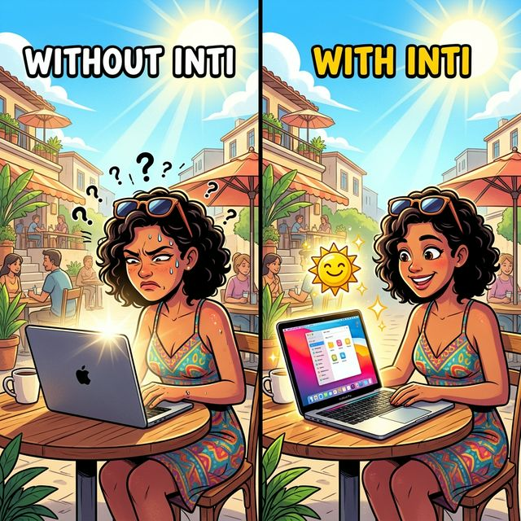

# Inti™

<p align="center">
  
</p>

Inti™ is a macOS native utility that unlocks the full brightness potential of your Apple Silicon MacBook Pro's Liquid Retina XDR display or external HDR monitor. By bypassing macOS's software brightness limits, Inti pushes your screen's backlight into its Extended Dynamic Range (EDR) hardware headroom securely and stably.

## Features
- **True HDR Brightness**: Utilizes pure Native Metal compositing to maintain the EDR multiplier effect without washing out screen colors.
- **Robust Background Stability**: Features a 60Hz background enforcement timer to defeat macOS WindowServer optimization, ensuring your brightness stays locked even when the app loses focus.
- **Menu Bar Native**: Operates entirely from the macOS Menu Bar (no Dock clutter).
- **Safe Multi-Monitor Support**: Automatically handles display reconnections and only applies the overdrive to the main HDR-capable screen.
- **Settings Persistence**: Remembers your preferred intensity and calibration state between launches.

## Requirements
- macOS 13.0 (Ventura) or later
- An XDR-capable display (MacBook Pro 14"/16" with Liquid Retina XDR, or Pro Display XDR)

## Installation

### Option 1: Download the app (recommended)

1. Go to [**Releases**](https://github.com/chezzandyto/inti-app/releases) and download the latest `Inti-vX.X.X-arm64.zip`.
2. Unzip the file and drag `Inti.app` to your **Applications** folder.
3. Double-click `Inti.app` to open it or search it in Spotlight. macOS will show a warning saying the app cannot be verified — click **Done** (or **Cancel**), don't move to trash.
4. Open **System Settings → Privacy & Security**, scroll down and find the message about Inti. Click **Open Anyway**.
5. A confirmation dialog will appear — click **Open**.
6. Inti will start and appear as a ☀️ icon in your **menu bar** (top-right of the screen).

> **Note:** This is a one-time process. After the first launch, macOS will remember your choice and open Inti normally from now on.

---

### Option 2: Build from source

<details>
<summary>Build the <code>.app</code> bundle</summary>

```bash
git clone https://github.com/chezzandyto/inti-app.git
cd inti-app
chmod +x scripts/build-app.sh
./scripts/build-app.sh
```
The compiled `Inti.app` will be at `build/Inti.app`.
</details>

<details>
<summary>Run from Xcode</summary>

1. Clone this repository.
2. Open `Package.swift` in Xcode 14 or newer.
3. Select the `Inti` scheme and run (`Cmd + R`).
</details>

<details>
<summary>Run from terminal</summary>

```bash
swift build -c release
.build/release/Inti
```
</details>

## How it Works
Inti creates a full-screen, completely transparent, click-through `NSWindow` overlay. Instead of relying on fragile Core Animation compositing filters that macOS disables to save power, Inti uses an `MTKView` (Metal Kit) combined with a high-frequency `Timer`.

The Metal layer creates a `multiplyBlendMode` effect. When combined with values far beyond standard white (`> 1.0` in the `.extendedLinearSRGB` color space), it physically forces the monitor hardware to increase the LED backlight intensity, identical to how HDR videos are rendered system-wide.

## Known Limitations
- **Mission Control / Exposé flashes**: When activating Mission Control, macOS aggressively suspends high-performance compositing filters (`multiplyBlendMode`) on background layers to maintain robust 60fps animations. This causes the brightness effect to momentarily turn off or flash a white frame during the Exposé transition. This is a known, intrinsic limitation of macOS WindowServer affecting all EDR overlay applications on the market today.
- **Cursor appearance**: The macOS cursor may appear slightly darker (grey edges instead of white) while the HDR boost is active. This is an inherent limitation of the `multiplyBlendMode` compositing technique — it can only brighten content below the overlay, but the hardware cursor is rendered by the system at SDR levels and cannot be affected by any window-level compositing filter.

## Disclaimer
Running your display at maximum HDR brightness for extended periods will significantly reduce battery life and may accelerate hardware degradation (such as Mini-LED wear or typical OLED burn-in if applicable). Use responsibly.

## License
- **Code**: [MIT License](LICENSE)
- **App icon and artwork**: © 2026 Andres Toapanta. All rights reserved. The app icon and visual assets in the `Resources/` directory may not be used, modified, or redistributed without explicit permission.
